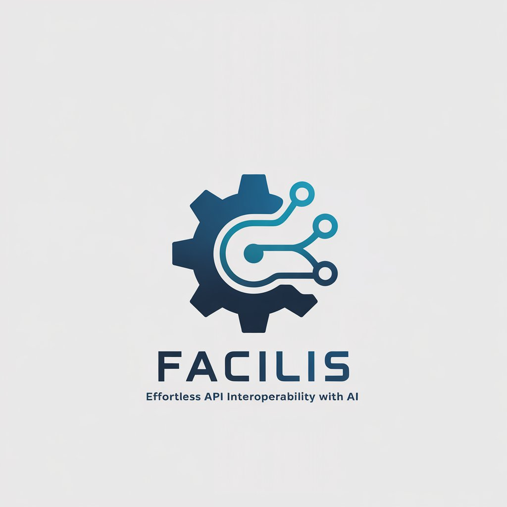

 [](https://openexchange.intersystems.com/package/Facilis)
 [](https://community.objectscriptquality.com/dashboard?id=intersystems_iris_community%2Fintersystems-iris-dev-template)
 [](https://community.objectscriptquality.com/dashboard?id=intersystems_iris_community%2Fintersystems-iris-dev-template)

[](LICENSE)

# Facilis - Effortless API Interoperability with AI

	

Facilis is an AI-powered solution designed to streamline API integration by extracting structured specifications from natural language descriptions. Now powered by CrewAI, Facilis ensures a more efficient and modular approach to handling API documentation and interoperability.

**How to pronounce Facilis**: [ˈfäkɪlʲɪs̠]

## 🚀 Motivation
Managing API integrations can be complex and error-prone. Facilis simplifies this process by leveraging AI to extract and validate API details, ensuring compliance with OpenAPI standards and facilitating seamless interoperability.

## 🛠️ How It Works
Facilis processes user-provided API descriptions, extracting key details such as endpoints, HTTP methods, parameters, authentication, and more. It then structures the extracted information into OpenAPI-compliant JSON and exports it to InterSystems IRIS for interoperability. The workflow consists of multiple AI agents, orchestrated by CrewAI, handling:

- **Extraction**: Identifies and structures API specifications from natural language.
- **Interaction**: Requests missing details from the user.
- **Validation**: Ensures API compliance and consistency.
- **Transformation**: Converts structured API details into OpenAPI JSON.
- **Review**: Verifies OpenAPI compliance before finalization.
- **Integration**:  Connects with Facilis API on InterSystems IRIS. Handles deployment configurations, creating the production, Business Services, Business Operations, and everything else

## 📋 Prerequisites
- Python 3.10+
- Docker & Docker Compose
- An API key from your preferred LLM provider (OpenAI, Azure OpenAI, Google Gemini, or Claude)

## 🛠️ Installation
### 1️⃣ Clone the Repository
```bash
git clone https://github.com/musketeers-br/dc-facilis
cd dc-facilis
```

### 2️⃣ Set Up Environment Variables
Facilis requires two `.env` files with the same variables:
- One in the root directory
- One inside `python/facilis/`

#### Create `.env` files based on the provided samples
```bash
cp env_sample .env
cp python/facilis/env_sample python/facilis/.env
```

#### Edit `.env` and `python/facilis/.env` with your settings
```ini
# AI Engine selection (choose one: openai, azureopenai, googleGemini, claude, ollama)
AI_ENGINE=openai  

# LLM Model Name
LLM_MODEL_NAME=gpt-4o-mini

# API Key for the selected AI provider
OPENAI_API_KEY=your-api-key-here
```

#### Why Two `.env` Files?
Facilis organizes its AI agents into two groups: **Planners** and **Generators**. You can assign different LLM models to each group. For example, you may want to use **Claude Sonnet** for planning and **GPT-4o** for generating. This setup allows greater flexibility in balancing speed, accuracy, and cost.

### 3️⃣ Run with Docker Compose
```bash
# Build the container
docker-compose build --no-cache --progress=plain

# Start the application
docker-compose up -d

# Stop and remove containers
docker-compose down --rmi all
```

## 💡 How to Use

### 1. Describe Your APIs
Simply describe your API endpoints in natural language. For example:

```
I want to retrieve all users from api.example.com/users using GET method and also create a new user POST api.example.com/users
```

This will be automatically converted into proper API specifications for:

- **GET /users** - Retrieve all users
- **POST /users** - Create a new user

### 2. Provide Production Details

- Enter your production name
- Specify the namespace

Facilis will handle the rest!

## 🚧 Limitations
- Accuracy of extracted API details depends on the quality of user input.
- LLM-based processing may introduce minor inconsistencies requiring manual review.
- Currently optimized for OpenAPI 3.0.
- Facilis has 16 AI agents and a complex processing pipeline. Due to this complexity, the entire process may take a considerable amount of time to execute.

- **Disclaimer**: Unfortunately, the app could hallucinate, as it depends on user input and the LLM model used. In our tests, GPT-4o and Claude Sonnet provided the best results, but they also hallucinate occasionally. In some cases, we needed to run the same prompt multiple times to achieve a satisfactory result. We are continuously working to improve accuracy and reliability.


## 🎖️ Credits
Facilis is developed with ❤️ by the Musketeers Team

* [José Roberto Pereira](https://community.intersystems.com/user/jos%C3%A9-roberto-pereira-0)
* [Henry Pereira](https://community.intersystems.com/user/henry-pereira)
* [Henrique Dias](https://community.intersystems.com/user/henrique-dias-2)
